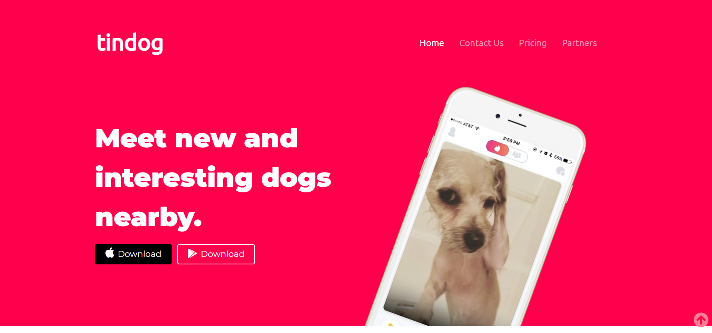
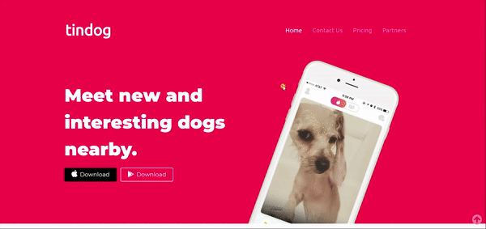

# Tindog - Udemy WebDev Bootcamp with Dr. Angela Yu
## Description
Derived from Udemy Web Development Bootcamp, this project named **TinDog** has been created from scratch taking inspiration from the course example.

## Technologies
1. HTML5
2. CSS3
3. Bootstrap5
4. Minimal JavaScript

## Features
1. Fully responsive website, suited to all screen sizes
2. Buttons feature hover states, sticky buttons and site scrollable links
3. Includes Z-indexing and other advanced CSS features
4. Bootstrap navbars, fluid containers, carousel and toggle capability
5. Hosted completely on Vercel
